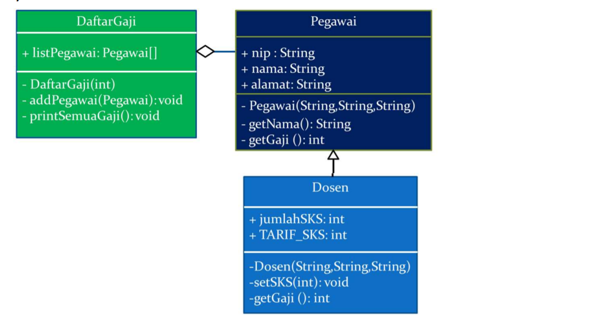

### Praktikum PBO 6
This is the sixth repository from PBO Practice in State Polytechnic of Malang. It is coded with Java Programming language. implements program from given class diagram in Jobsheet.

- 📝 Pdf filename :[2C_24_Yudas Malabi.pdf](https://github.com/Yudas1337/Praktikum_PBO_6/blob/master/2C_24_Yudas%20Malabi.pdf)

### Main Topic : Inheritance
### Class Diagram : 

### Class Structure :
<ul>
  <li>Pegawai     : Representing Pegawai class</li>
  <li>Dosen       : Representing Dosen class that have inherit from Pegawai class</li>
  <li>DaftarGaji  : Representing DaftarGaji class that have relationship with Pegawai</li>
  <li>Main        : Run the java program from each declared class</li>
  
</ul>

### Technologies :
<ul>
<li>Java Object Oriented Programming</li>
<li>IDE : Visual Studio Code with java plugins for compiler</li>
</ul>

### Credits : Yudas Malabi 😄✌️
